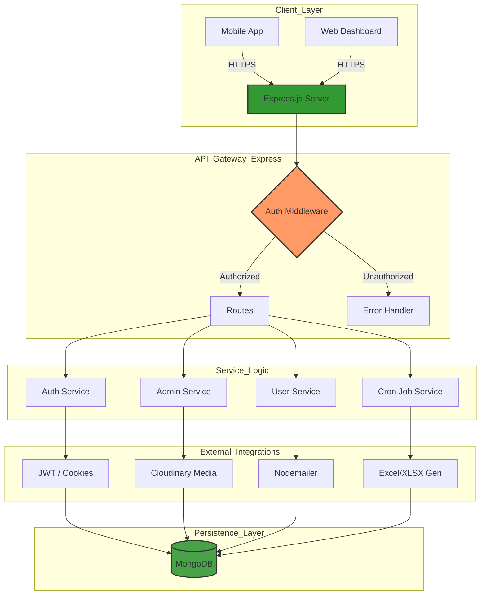

# 🚀 YoutubeNodjs: Advanced Documentation

Welcome to the advanced technical guide for **YoutubeNodjs**. This document covers the internal architecture, security implementations, and specialized services used in this project.

---

## 🏗️ Architecture Overview

The project follows a **Service-Oriented Architecture** (SOA) pattern, separating concerns between routing, business logic, and data persistence.

### 1. Database Layer (`/src/DataBase`)
The system uses **Mongoose** for object modeling. The connection is established in `index.ts` and managed within the DataBase folder to ensure high availability and proper error handling.

### 2. Middleware Strategy (`/src/middlewres`)
-   **Authentication**: Custom JWT verification middleware that checks for valid tokens in headers or cookies.
-   **Authorization**: Role-based access control (RBAC) specifically for Admin routes.
-   **Error Handling**: Centralized middleware to catch and format API errors.

### 3. Business Logic & Services (`/src/services`)
-   **Cloudinary Integration**: Handles optimized image and video uploads, providing URLs for frontend consumption.
-   **Cron Jobs**: Background processes are managed here. The system currently runs scheduled tasks (e.g., data cleanup or automated reports).
-   **Excel Generation**: Uses the `xlsx` library to transform MongoDB documents into downloadable Excel reports.

---

## 🔒 Security Implementations

-   **JWT Cookies**: Secure, HTTP-only cookies are used to store session tokens, mitigating XSS attacks.
-   **CORS Configuration**: Restricts access to specific origins to prevent unauthorized cross-origin requests.
-   **Password Hashing**: (Ensure `bcrypt` is implemented) All user passwords should be hashed before storage.

---

## 🛠️ API Reference (Draft)

| Endpoint | Method | Description | Access |
| :--- | :--- | :--- | :--- |
| `/Auth/login` | POST | Authenticate user & return token | Public |
| `/Admin/dashboard` | GET | Retrieve administrative stats | Admin Only |
| `/users/profile` | GET | Get current user details | User/Admin |

---

## 📈 Performance & Scaling

1.  **TypeScript Compilation**: Leveraging `tsc` for type safety and `ts-node` for rapid development.
2.  **Stateless Design**: The backend is stateless, allowing for horizontal scaling across multiple containers or instances.
3.  **Cloudinary CDN**: Offloading media delivery to a global Content Delivery Network for faster load times.

---

## 🧪 Development Workflow

### Scripts
-   `npm run dev`: Starts the server with `nodemon` and `ts-node` for hot-reloading.
-   `npm run build`: Compiles TypeScript to optimized JavaScript.

---

## 🛠️ Upcoming Features

-   [ ] AI-based video content analysis.
-   [ ] Real-time notifications using Socket.io.
-   [ ] Dockerization for simplified deployment.

---

> [!IMPORTANT]
> This documentation is intended for developers and system administrators. For basic setup, please refer to the [standard README](./README.md).
